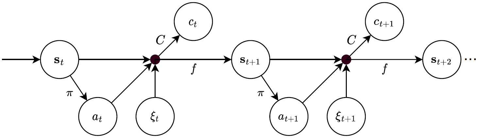

A brief introduction to MDPs
============================

Welcome to the world of Markov Decision Processes (MDPs)! MDPs are a fundamental concept in the field of artificial intelligence and reinforcement learning. They are widely used to model decision-making problems where an agent interacts with an environment to maximize some notion of cumulative reward.

What is an MDP?
---------------

A Markov Decision Process (MDP) is a mathematical framework used to model decision-making problems in which an agent interacts with an environment over a series of discrete time steps. At each time step, the agent observes the current state of the environment and selects an action. The environment responds by transitioning to a new state and providing a reward signal to the agent. Importantly, the transition to the next state and the reward received only depend on the current state and the action taken, satisfying the Markov property.

Key Components of an MDP
-------------------------

1. **States (S):** The set of all possible situations or configurations in which the agent can find itself.

2. **Actions (A):** The set of all possible moves or decisions that the agent can make in a given state.

3. **Costs (C):** The numerical values associated with state-action pairs, indicating the immediate cost of taking a particular action in a specific state. Note that a reward is a negative cost. 

A key related concept is that of a policy, which specifies the action to take in each state:

4. **Policy (π):** A strategy that specifies which action to take in each state.

DynaPlex builds on the MDP-EI (MDP with exogenous inputs) framework, which is illustrated below. Here, :math:`s_t` represents the state at time :math:`t`, :math:`\pi` represent the policy, :math:`a_t` the decision, and :math:`c_t` the costs. We further denote a random event by :math:`\xi_t` and the transition function is :math:`f`.
For more information, we refer to: `ArXiv paper <https://arxiv.org/abs/2011.15122>`_, `A unified framework for stochastic optimization <https://doi.org/10.1016/j.ejor.2018.07.014>`_. See also the published version of the Deep Controlled Learning paper: `published version <https://www.sciencedirect.com/science/article/pii/S0377221725000463>`_.

Why MDPs are Important
-----------------------

MDPs provide a formal and systematic way to model and solve decision-making problems. They are used in various applications, including robotics, game playing, autonomous systems, and optimization tasks. By understanding and implementing MDPs, you can design intelligent agents capable of making optimal decisions in complex, uncertain environments.

Explore the rest of our documentation to learn how to get started, create your own MDPs, and leverage the full capabilities of our software tool. Happy coding!

.. note::
   For detailed guides and examples, please refer to the specific sections of this documentation site.

MDP models in DynaPlex
----------------------

DynaPlex models are defined as an MDP dataclass. This dataclass has specific methods which are required, and which manipulate objects of another user-defined class that represents the state of the problem. Examples are the Airplane Ticket Selling MDP and the Bin Packing MDP: :doc:`Airplane Ticket Selling MDP <../tutorial/airplane_mdp>` and :doc:`Bin Packing MDP <../tutorial/binpacking_mdp>`. The Python code for these MDPs is available in the :doc:`Airplane MDP Python Code <../tutorial/airplane_mdp_python_code>` and :doc:`Bin Packing MDP Python Code <../tutorial/binpacking_mdp_python_code>` pages.

Classes and methods in DynaPlex MDPs must adhere to certain structural and semantic properties. For more information, see the :doc:`Language Reference <../reference/language_reference>`.

Recommended Reference Books
---------------------------

For further exploration of Markov Decision Processes, we recommend the following books:

1. "Markov Decision Processes: Discrete Stochastic Dynamic Programming" by Martin L. Puterman.
   - This book offers a thorough treatment of MDPs, including dynamic programming methods and their applications.

2. "Dynamic Programming and Optimal Control" by Dimitri P. Bertsekas.
   - A comprehensive reference covering dynamic programming techniques, including their application in solving MDPs and optimal control problems.

3. "Reinforcement Learning and Stochastic Optimization" by Warren B. Powell.
   - A valuable resource that explores the intersection of reinforcement learning and stochastic optimization, providing insights into advanced techniques.
